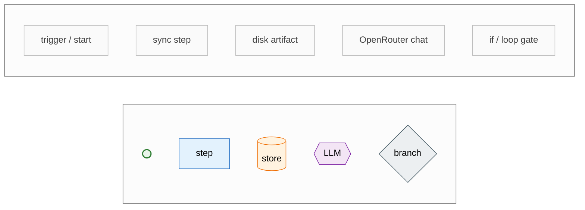

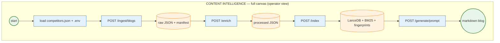

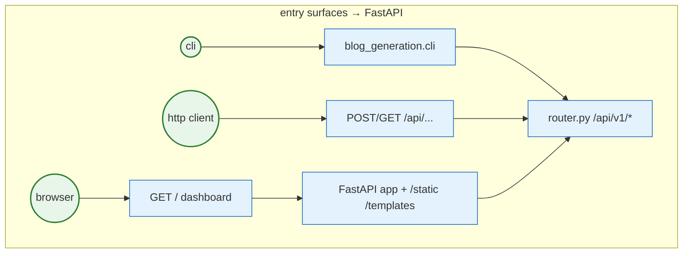

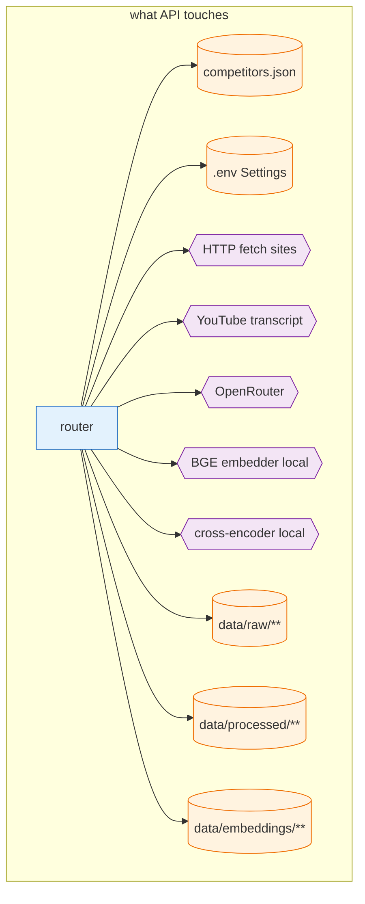

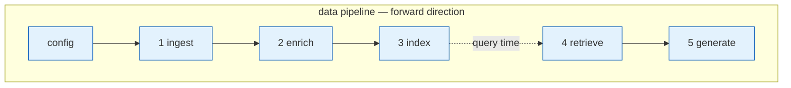

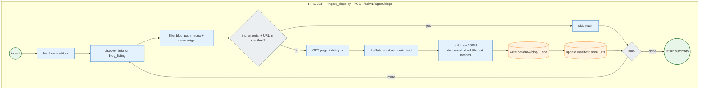

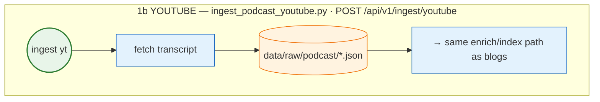

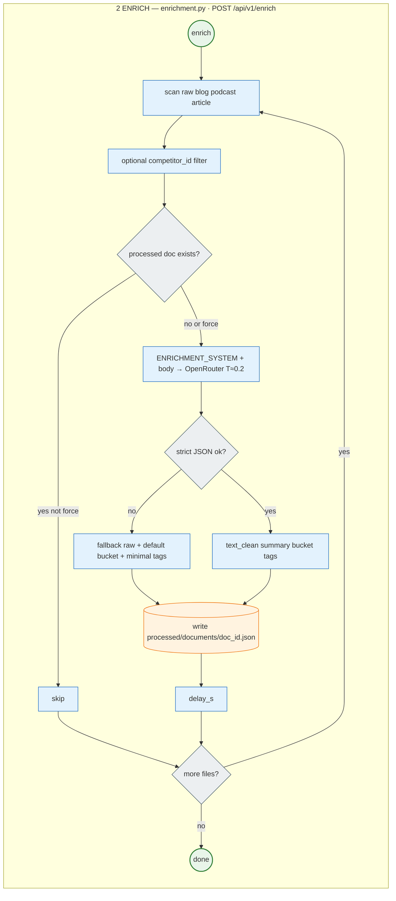

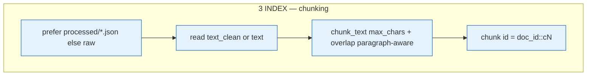

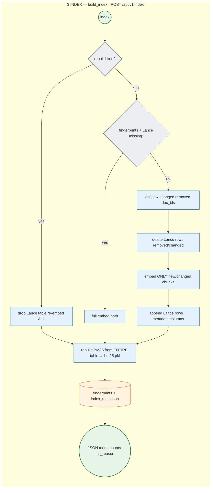

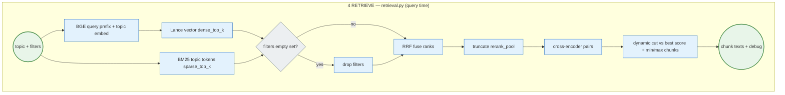

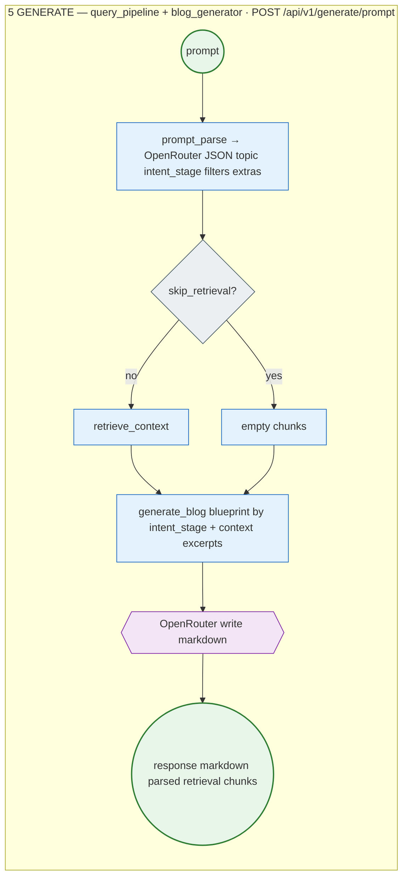

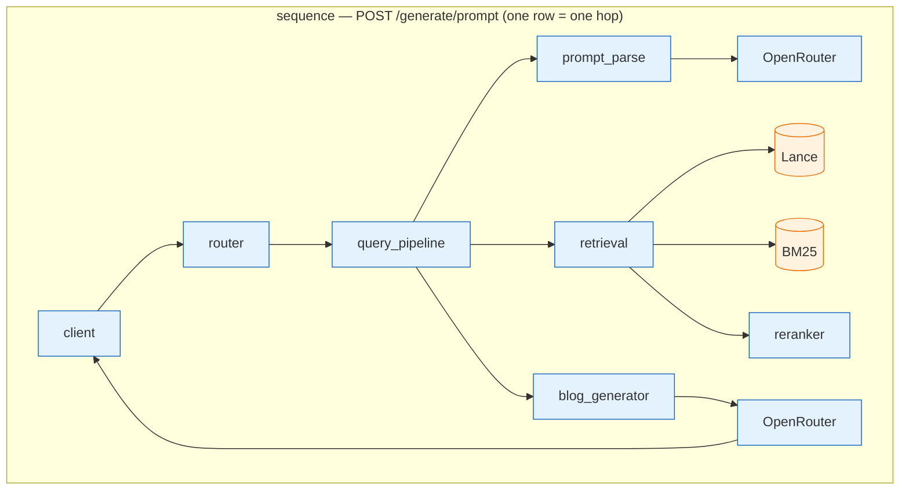

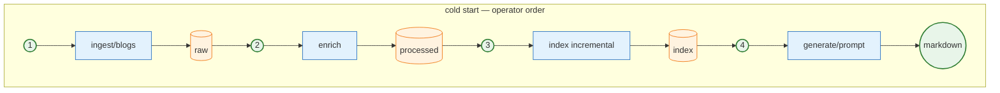

```mermaid
flowchart TB
  subgraph APIMAP["HTTP nodes"]
    direction LR
    subgraph RO["GET"]
      R1[/health]:::action
      R2[/v1/stats]:::action
      R3[/v1/documents/blogs]:::action
      R4[/]:::action
    end
    subgraph WO["POST pipeline"]
      W1[/v1/ingest/blogs]:::action
      W2[/v1/ingest/youtube]:::action
      W3[/v1/enrich]:::action
      W4[/v1/index]:::action
    end
    subgraph GEN["POST generate"]
      G1[/v1/generate/prompt RAG]:::action
      G2[/v1/generate/blog explicit]:::action
    end
  end
  classDef action fill:#E3F2FD,stroke:#1565C0,stroke-width:1px
```

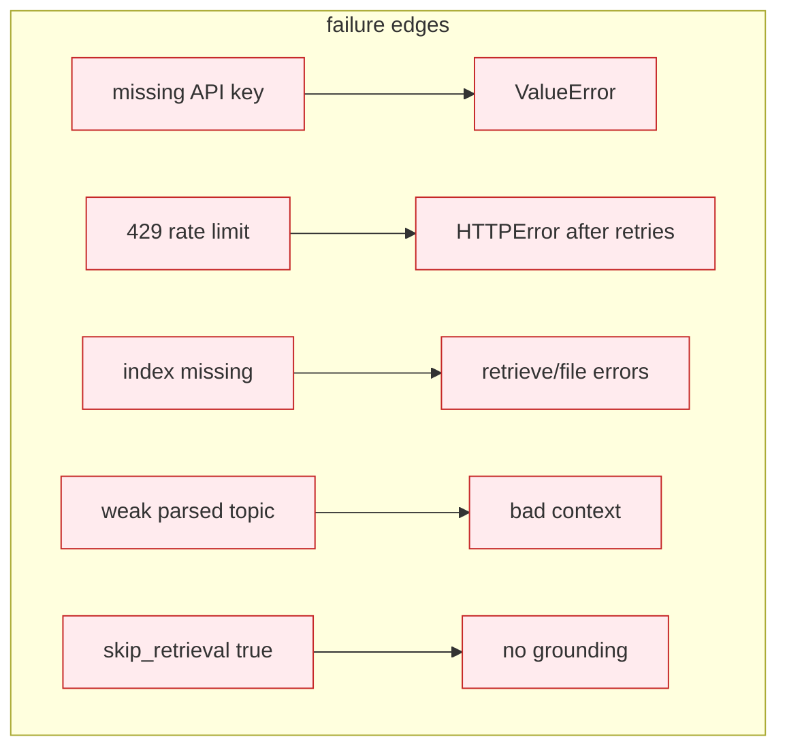
